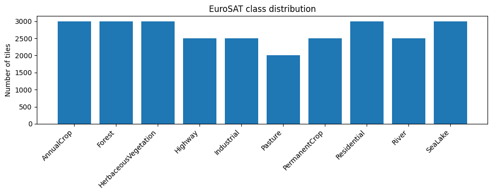
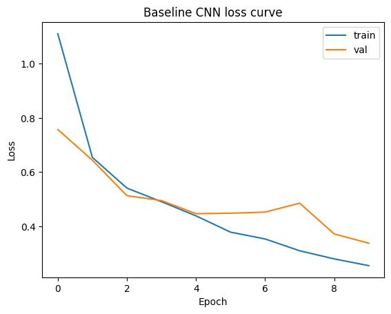
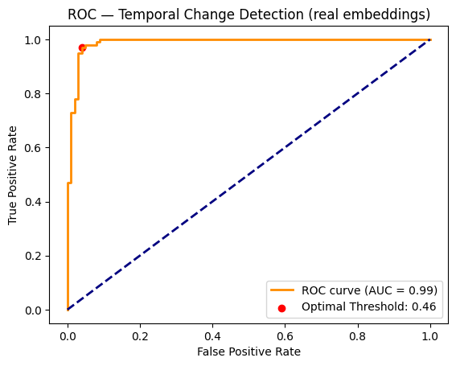

# FINAL-PROJECT
# Satellite Image Land-Use Classifier & Temporal Change Detector

A computer vision system that classifies land-use types from satellite imagery and detects land-cover change between two time periods, built on transfer learning, embedding-based change detection, and an interactive dashboard.

  

---

## Overview

| | |
|---|---|
| **Primary dataset** | [EuroSAT](https://github.com/phelber/EuroSAT) — 27,000 Sentinel-2 tiles, 10 land-use classes |
| **Holdout test set** | UC Merced Land Use — 2,100 images, 21 classes |
| **Backbone** | ResNet-18 (ImageNet-pretrained), two-phase fine-tuning |
| **Deliverables** | Training/eval notebook, Gradio dashboard, PDF report |

This repo covers three linked modules:

1. **Land-Use Classifier** — transfer learning on EuroSAT with a two-phase fine-tuning strategy
2. **Temporal Change Detector** — embedding-based cosine similarity + ROC-driven threshold selection
3. **Geo-Dashboard** — a Gradio app that classifies two tiles and flags change between them

---

## Results

### Classifier performance

| Model | EuroSAT val macro-F1 | UC Merced (matched subset) macro-F1 |
|---|---|---|
| Baseline CNN (scratch, 10 epochs) | 0.879 | — |
| ResNet-18, frozen backbone only (8 epochs) | 0.849 | 0.084 |
| ResNet-18, two-phase fine-tuned (3+5 epochs) | **0.954** | not separately evaluated* |

\* the fully fine-tuned model's UC Merced score wasn't computed in this run — only the frozen-backbone variant was cross-evaluated.

> **Note on the domain gap:** macro-F1 collapses from 0.849 (EuroSAT val) to 0.084 (UC Merced matched subset) for the frozen-backbone model — a real domain shift between Sentinel-2 (EuroSAT) and aerial (UC Merced) imagery, not a labeling artifact.

<p align="center">
  <br>
  <sub>EuroSAT class distribution</sub>
</p>

<p align="center">
  
  <br>
  <sub>Baseline CNN loss curve (left) vs. two-phase fine-tuned ResNet-18 loss curve (right)</sub>
</p>

<p align="center">
  <br>
  <sub>Fine-tuned model — EuroSAT validation confusion matrix (macro-F1 = 0.954)</sub>
</p>

### Change detection

<p align="center">
  <br>
  <sub>ROC curve over 200 simulated T1/T2 pairs — AUC = 0.988, selected threshold = 0.456 cosine similarity</sub>
</p>

<p align="center">
  <br>
  <br>
  <sub>Sample change heatmaps (green = no change, red = changed). See <code>notebooks/</code> for all 5 required pairs.</sub>
</p>

### Error analysis

<p align="center">
  <br>
  <sub>Top-5 highest-confidence misclassifications on EuroSAT validation</sub>
</p>

### Spatial leakage experiment

| Split strategy | Val macro-F1 |
|---|---|
| Random split (3 epochs, frozen head only) | 0.851 |
| Spatial block split (3 epochs, frozen head only) | 0.849 |

Gap is negligible (~0.002) at this scale — a useful negative result, reported as-is rather than assumed away.

---

## Dashboard

Built with Gradio — accepts two tiles (before/after) and returns:
- predicted land-use class + confidence for each tile
- cosine similarity score between their embeddings
- a side-by-side change heatmap with a CHANGED / NO CHANGE flag

```bash
python app.py
# runs locally at http://127.0.0.1:7860
```

---

## Project structure

```
.
├── notebooks/
│   └── satellite_classifier_change_detector.ipynb   # full training + eval pipeline
├── app.py                                            # Gradio dashboard
├── checkpoints/
│   └── finetuned_resnet18_eurosat.pt                 # trained model weights
├── report/
│   └── project_report.pdf                            # full write-up (max 8 pages)
├── assets/                                           # figures used in this README
├── requirements.txt
└── README.md
```

---

## Setup

```bash
git clone https://github.com/<your-username>/<your-repo>.git
cd <your-repo>
pip install -r requirements.txt
```

`requirements.txt` should include at minimum:
```
torch
torchvision
scikit-learn
matplotlib
opencv-python
gradio
numpy
```

## Usage

1. Run `notebooks/satellite_classifier_change_detector.ipynb` top to bottom to reproduce training, evaluation, and figures (downloads EuroSAT via `torchvision` and UC Merced via the Kaggle API — a `kaggle.json` API key is required for the latter).
2. Launch the dashboard: `python app.py`.
3. Upload a "before" and "after" tile to see classification + change detection output.

---

## Limitations

- **Cross-dataset generalization gap** — macro-F1 drops from 0.849 to 0.084 between EuroSAT and UC Merced (matched subset); the two datasets differ in sensor, resolution, and imaging altitude.
- EuroSAT has no genuine before/after imagery — Module 2's T1/T2 pairs are a documented simulation (same tile re-augmented = unchanged, cross-class pairs = changed), not real temporal data.
- The "spatial" block split is a pseudo-spatial proxy based on on-disk tile order, since the public `torchvision` EuroSAT loader doesn't expose true tile lat/lon.
- EuroSAT (10 classes) and UC Merced (21 classes) don't share a label set — cross-dataset evaluation uses a manually matched 5-class subset (forest, freeway, buildings, denseresidential, river); the remaining 16 UC Merced classes are excluded by design.

